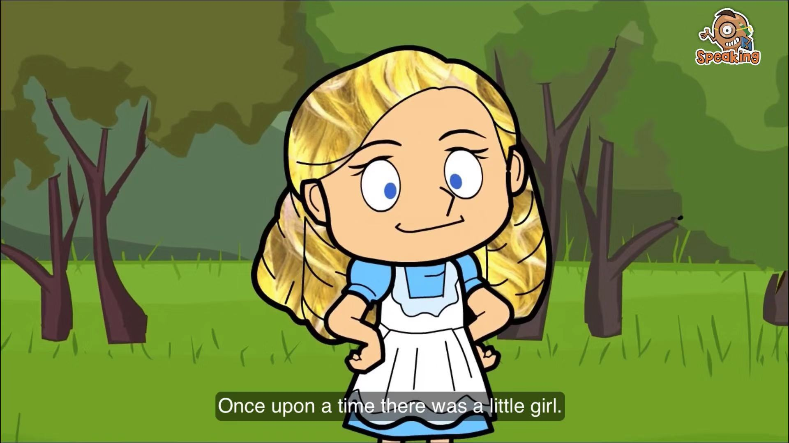
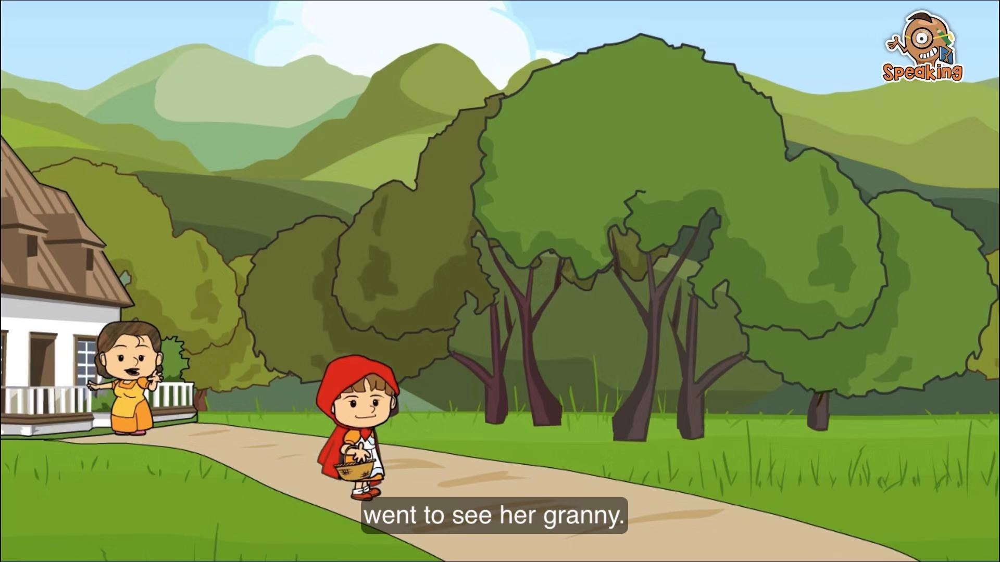
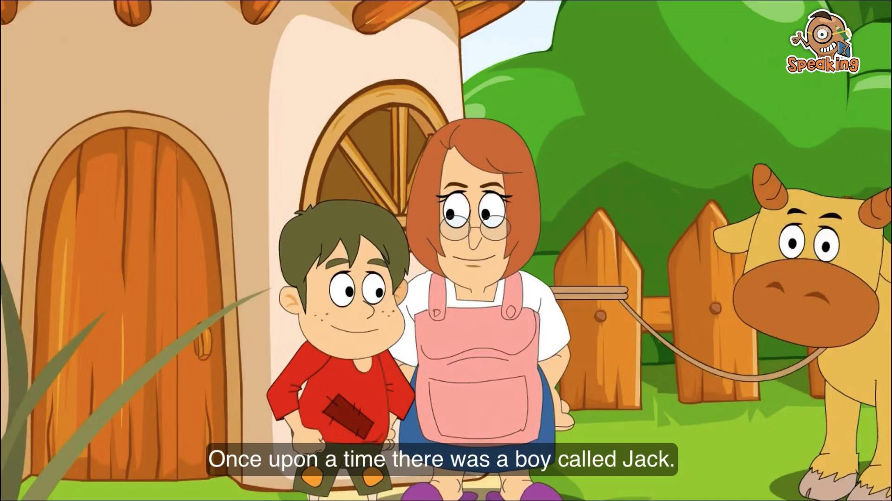
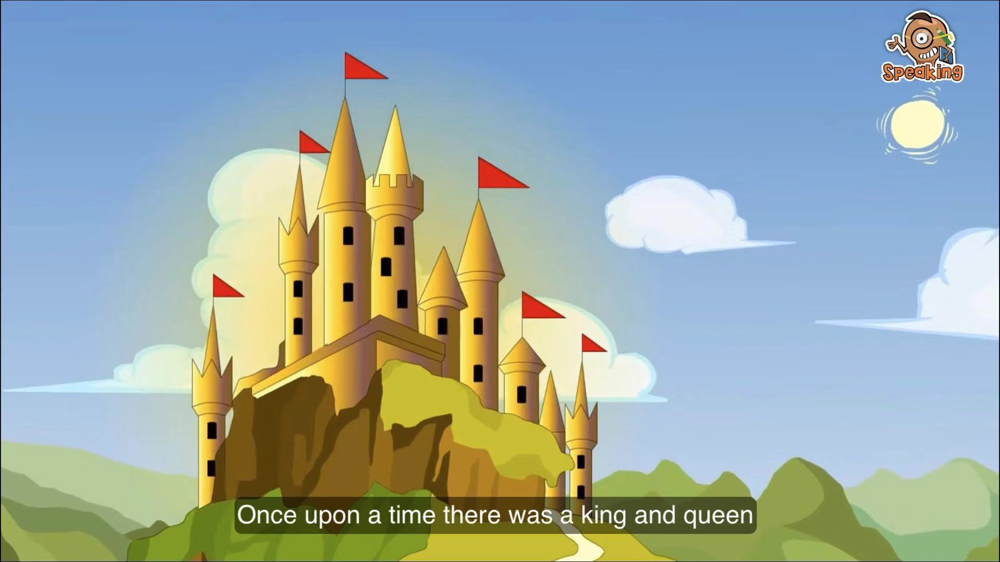

# British Council - Learn English Kids

All resources list in this page are used for english learning purpose (just for my kids and me ^_^). All of them are free and you can watch these videos on British Council official website or youtube. I recommented you to download the app named "playtime" on app store if you are using an iPhone, It's very nice for kids learning. 

These fantastic learning materials also including worksheet, so you can do practise with your kids after watching each little story and you will find the answers at the end of **transcript & worksheet** section.

Enjoy it!

[TOC]

## 01. Goldilocks and the Three Bears

Goldilocks goes into a house in the forest. What will she find there? Watch and find out!

### Video

* [Official link](https://learnenglishkids.britishcouncil.org/short-stories/goldilocks-and-the-three-bears)
* [Youtube link](https://www.youtube.com/watch?v=Oaw-d3r_gIc)

### Transcript & worksheet

* [The story](./01.Goldilocks-and-the-Three-Bears/short-stories-goldilocks-and-the-three-bears-transcript.pdf)
* [An activity for the story](./01.Goldilocks-and-the-Three-Bears/short-stories-goldilocks-and-the-three-bears-worksheet.pdf)
* [The answers](./01.Goldilocks-and-the-Three-Bears/short-stories-goldilocks-and-the-three-bears-answers.pdf)

## 02. Little Red Riding Hood

One day Little Red Riding Hood goes to visit her granny. Who will she meet in the wood? Watch and find out!

### Video

* [Official link](https://learnenglishkids.britishcouncil.org/short-stories/little-red-riding-hood)
* [Youtube link](https://www.youtube.com/watch?v=GbzMC6qAzVU)

### Transcript & worksheet

* [The story](./02.Little-Red-Riding-Hood/short-stories-little-red-riding-hood-transcript.pdf)
* [An activity for the story](./02.Little-Red-Riding-Hood/short-stories-little-red-riding-hood-worksheet.pdf)
* [The answers](./02.Little-Red-Riding-Hood/short-stories-little-red-riding-hood-answers.pdf)

## 03. Jack and the Beanstalk

Jack has some magic beans! What will happen when they start to grow in his garden? Watch and find out!

### Video

* [Official link](https://learnenglishkids.britishcouncil.org/short-stories/jack-and-the-beanstalk)
* [Youtube link](https://www.youtube.com/watch?v=rKB1_wBueFM&t=15s)

### Transcript & worksheet

* [The story](./03.Jack-and-the-Beanstalk/short-stories-jack-and-the-beanstalk-transcript.pdf)
* [An activity for the story](./03.Jack-and-the-Beanstalk/short-stories-jack-and-the-beanstalk-worksheet.pdf)
* [The answers](./03.Jack-and-the-Beanstalk/short-stories-jack-and-the-beanstalk-answers.pdf)

## 04. The princess and the dragon

A horrible monster has locked the princess up in a tower. Can anybody rescue her? Watch and find out!

### Video

* [Official link](https://learnenglishkids.britishcouncil.org/short-stories/the-princess-and-the-dragon)
* [Youtube link](https://www.youtube.com/watch?v=oepRTA4s4XM)

### Transcript & worksheet

* [The story](./04.The-princess-and-the-dragon/short-stories-the-princess-and-the-dragon-transcript.pdf)
* [An activity for the story](./04.The-princess-and-the-dragon/short-stories-the-princess-and-the-dragon-worksheet.pdf)
* [The answers](./04.The-princess-and-the-dragon/short-stories-the-princess-and-the-dragon-answers.pdf)
* [Flashcards](./04.The-princess-and-the-dragon/stories-the-princess-and-the-dragon-flashcards.pdf)

## 05. The bird king

This traditional story is about a race to become the bird king. Which bird will become king? Watch and find out!

### Video

* [Official link](https://learnenglishkids.britishcouncil.org/short-stories/the-bird-king)
* [Youtube link](https://www.youtube.com/watch?v=sn1_4Iqn6TY&t=9s)

### Transcript & worksheet

* [The story](./05.The-bird-king/short-stories-story-time-the-bird-king-transcript.pdf)
* [An activity for the story](./05.The-bird-king/short-stories-story-time-the-bird-king-worksheet.pdf)
* [The answers](./05.The-bird-king/short-stories-story-time-the-bird-king-answers.pdf)

## 06. The clever monkey

This traditional story is about wanting what your friends have. Will the crocodile get the monkey's heart? Watch and find out!

### Video

* [Official link](https://learnenglishkids.britishcouncil.org/short-stories/the-clever-monkey)
* [Youtube link](https://www.youtube.com/watch?v=uWzjLu7e6KM&t=3s)

### Transcript & worksheet

* [The story](./06.The-clever-monkey/short-stories-story-time-the-clever-monkey-transcript.pdf)
* [An activity for the story](./06.The-clever-monkey/short-stories-story-time-the-clever-monkey-worksheet.pdf)
* [The answers](./06.The-clever-monkey/short-stories-story-time-the-clever-monkey-answers.pdf)
