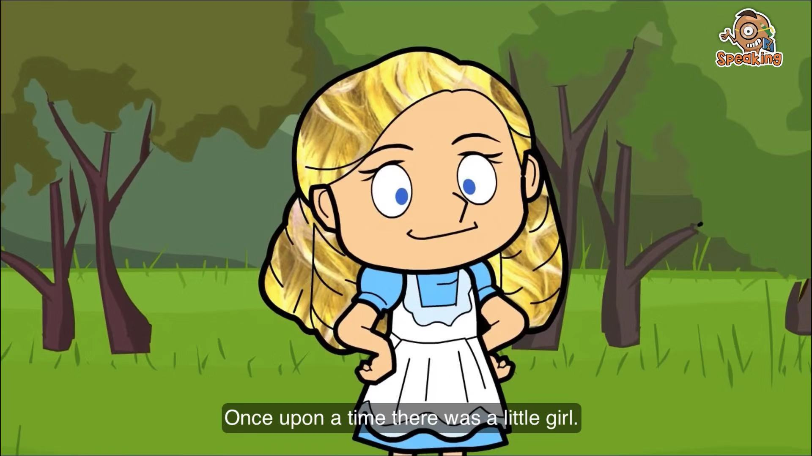

# British Council - Learn English Kids

All resources list in here are used for english learning for my kids. All of them are free and you can watch the video in British Council official website or youtube. I recommented you to download the app "playtime" on your mobile phone if you are using iPhone, It's very nice for kids learning. 

## 01. Goldilocks and the three bears

Goldilocks goes into a house in the forest. What will she find there? Watch and find out!

[Official link](https://learnenglishkids.britishcouncil.org/short-stories/goldilocks-and-the-three-bears)
[Youtube link](https://www.youtube.com/watch?v=Oaw-d3r_gIc)

Transcript & worksheet

* [The story](./01.Goldilocks-and-the-three-bears/short-stories-goldilocks-and-the-three-bears-transcript.pdf)
* [An activity for the story](./01.Goldilocks-and-the-three-bears/short-stories-goldilocks-and-the-three-bears-worksheet.pdf)
* [The answers](./01.Goldilocks-and-the-three-bears/short-stories-goldilocks-and-the-three-bears-answers.pdf)
