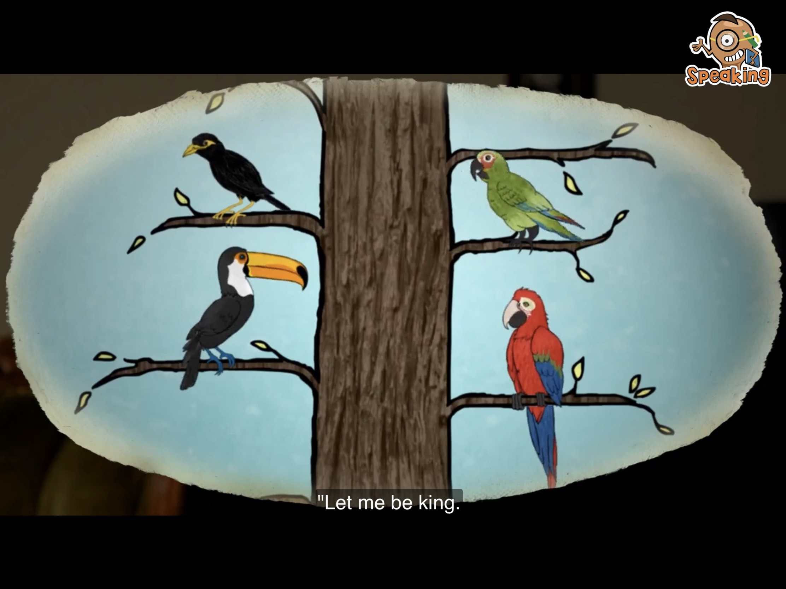

# British Council - Learn English Kids

All resources list in this page are used for english learning purpose (just for my kids and me ^_^). All of them are free and you can watch these videos on British Council official website or youtube. I recommented you to download the app named "playtime" on app store if you are using an iPhone, It's very nice for kids learning. 

These fantastic learning materials also including worksheet, so you can do practise with your kids after watching each little story and you will find the answers at the end of **transcript & worksheet** section.

Enjoy it!

## 01. Goldilocks and the Three Bears

Goldilocks goes into a house in the forest. What will she find there? Watch and find out!

### Video

* [Official link](https://learnenglishkids.britishcouncil.org/short-stories/goldilocks-and-the-three-bears)
* [Youtube link](https://www.youtube.com/watch?v=Oaw-d3r_gIc)

### Transcript & worksheet

* [The story](./01.Goldilocks-and-the-Three-Bears/short-stories-goldilocks-and-the-three-bears-transcript.pdf)
* [An activity for the story](./01.Goldilocks-and-the-Three-Bears/short-stories-goldilocks-and-the-three-bears-worksheet.pdf)
* [The answers](./01.Goldilocks-and-the-Three-Bears/short-stories-goldilocks-and-the-three-bears-answers.pdf)

## 02. Little Red Riding Hood

One day Little Red Riding Hood goes to visit her granny. Who will she meet in the wood? Watch and find out!

### Video

* [Official link](https://learnenglishkids.britishcouncil.org/short-stories/little-red-riding-hood)
* [Youtube link](https://www.youtube.com/watch?v=GbzMC6qAzVU)

### Transcript & worksheet

* [The story](./02.Little-Red-Riding-Hood/short-stories-little-red-riding-hood-transcript.pdf)
* [An activity for the story](./02.Little-Red-Riding-Hood/short-stories-little-red-riding-hood-worksheet.pdf)
* [The answers](./02.Little-Red-Riding-Hood/short-stories-little-red-riding-hood-answers.pdf)

## 03. Jack and the Beanstalk

Jack has some magic beans! What will happen when they start to grow in his garden? Watch and find out!

### Video

* [Official link](https://learnenglishkids.britishcouncil.org/short-stories/jack-and-the-beanstalk)
* [Youtube link](https://www.youtube.com/watch?v=rKB1_wBueFM&t=15s)

### Transcript & worksheet

* [The story](./03.Jack-and-the-Beanstalk/short-stories-jack-and-the-beanstalk-transcript.pdf)
* [An activity for the story](./03.Jack-and-the-Beanstalk/short-stories-jack-and-the-beanstalk-worksheet.pdf)
* [The answers](./03.Jack-and-the-Beanstalk/short-stories-jack-and-the-beanstalk-answers.pdf)

## 04. The princess and the dragon

A horrible monster has locked the princess up in a tower. Can anybody rescue her? Watch and find out!

### Video

* [Official link](https://learnenglishkids.britishcouncil.org/short-stories/the-princess-and-the-dragon)
* [Youtube link](https://www.youtube.com/watch?v=oepRTA4s4XM)

### Transcript & worksheet

* [The story](./04.The-princess-and-the-dragon/short-stories-the-princess-and-the-dragon-transcript.pdf)
* [An activity for the story](./04.The-princess-and-the-dragon/short-stories-the-princess-and-the-dragon-worksheet.pdf)
* [The answers](./04.The-princess-and-the-dragon/short-stories-the-princess-and-the-dragon-answers.pdf)
* [Flashcards](./04.The-princess-and-the-dragon/stories-the-princess-and-the-dragon-flashcards.pdf)

## 05. The bird king

This traditional story is about a race to become the bird king. Which bird will become king? Watch and find out!

### Video

* [Official link](https://learnenglishkids.britishcouncil.org/short-stories/the-bird-king)
* [Youtube link](https://www.youtube.com/watch?v=sn1_4Iqn6TY&t=9s)

### Transcript & worksheet

* [The story](./05.The-bird-king/short-stories-story-time-the-bird-king-transcript.pdf)
* [An activity for the story](./05.The-bird-king/short-stories-story-time-the-bird-king-worksheet.pdf)
* [The answers](./05.The-bird-king/short-stories-story-time-the-bird-king-answers.pdf)

## 06. The clever monkey

This traditional story is about wanting what your friends have. Will the crocodile get the monkey's heart? Watch and find out!

### Video

* [Official link](https://learnenglishkids.britishcouncil.org/short-stories/the-clever-monkey)
* [Youtube link](https://www.youtube.com/watch?v=uWzjLu7e6KM&t=3s)

### Transcript & worksheet

* [The story](./06.The-clever-monkey/short-stories-story-time-the-clever-monkey-transcript.pdf)
* [An activity for the story](./06.The-clever-monkey/short-stories-story-time-the-clever-monkey-worksheet.pdf)
* [The answers](./06.The-clever-monkey/short-stories-story-time-the-clever-monkey-answers.pdf)

## 07. The lion and the mouse

This traditional story is about helping a friend. Can a mouse help a lion? Watch and find out!

### Video

* [Official link](https://learnenglishkids.britishcouncil.org/short-stories/the-lion-and-the-mouse)
* [Youtube link](https://www.youtube.com/watch?v=TVOBACpbTHc)

### Transcript & worksheet

* [The story](./07.The-lion-and-the-mouse/short-stories-story-time-the-lion-and-the-mouse-transcript.pdf)
* [An activity for the story](./07.The-lion-and-the-mouse/short-stories-story-time-the-lion-and-the-mouse-worksheet.pdf)
* [The answers](./07.The-lion-and-the-mouse/short-stories-story-time-the-lion-and-the-mouse-answers.pdf)

## 08. The lump of gold

This traditional story is about what makes you happy. Will Paul be happy when he buys a lump of gold? Watch and find out!

### Video

* [Official link](https://learnenglishkids.britishcouncil.org/short-stories/the-lump-gold)
* [Youtube link](https://www.youtube.com/watch?v=6JBLY__29sA)

### Transcript & worksheet

* [The story](./08.The-lump-of-gold/short-stories-story-time-the-lump-of-gold-transcript.pdf)
* [An activity for the story](./08.The-lump-of-gold/short-stories-story-time-the-lump-of-gold-worksheet.pdf)
* [The answers](./08.The-lump-of-gold/short-stories-story-time-the-lump-of-gold-answers.pdf)

## 09. The magic fish

This traditional story is about finding a very special fish. Will Robert and his grandfather catch the magic fish? Watch and find out!

### Video

* [Official link](https://learnenglishkids.britishcouncil.org/short-stories/the-magic-fish)

### Transcript & worksheet

* [The story](./09.The-magic-fish/short-stories-story-time-the-magic-fish-transcript.pdf)
* [An activity for the story](./09.The-magic-fish/short-stories-story-time-the-magic-fish-worksheet.pdf)
* [The answers](./09.The-magic-fish/short-stories-story-time-the-magic-fish-answers.pdf)

## 11. The sneaky rabbit

This traditional story is about how a rabbit tricks a tiger. Will the rabbit escape? Watch and find out!

### Video

* [Official link](https://learnenglishkids.britishcouncil.org/short-stories/the-sneaky-rabbit)

### Transcript & worksheet

* [The story](./11.The-sneaky-rabbit/short-stories-story-time-the-sneaky-rabbit-transcript.pdf)
* [An activity for the story](./11.The-sneaky-rabbit/short-stories-story-time-the-sneaky-rabbit-worksheet.pdf)
* [The answers](./11.The-sneaky-rabbit/short-stories-story-time-the-sneaky-rabbit-answers.pdf)
 

## 12. The ugly duckling

This traditional story is about being friends with people who are different from you. Will the ugly duckling find a friend? Watch and find out!

### Video

* [Official link](https://learnenglishkids.britishcouncil.org/short-stories/the-ugly-duckling)

### Transcript & worksheet

* [The story](./12.The-ugly-duckling/short-stories-story-time-the-ugly-duckling-transcript.pdf)
* [An activity for the story](./12.The-ugly-duckling/short-stories-story-time-the-ugly-duckling-worksheet.pdf)
* [The answers](./12.The-ugly-duckling/short-stories-story-time-the-ugly-duckling-answers.pdf)

## 13. A dog's life

Dino the family dog helps to keep people safe on the roads. What did he do last week? Watch and find out!

### Video

* [Official link](https://learnenglishkids.britishcouncil.org/short-stories/dogs-life)

### Transcript & worksheet

* [The story](./13.A-dogs-life/short-stories-a-dogs-life-transcript.pdf)
* [An activity for the story](./13.A-dogs-life/short-stories-a-dogs-life-worksheet.pdf)
* [The answers](./13.A-dogs-life/short-stories-a-dogs-life-answers.pdf)

## 14. Dark dark wood

There are strange things in the dark, dark wood! What are they? Watch and find out!

### Video

* [Official link](https://learnenglishkids.britishcouncil.org/short-stories/dark-dark-wood)

### Transcript & worksheet

* [The story](./14.Dark-dark-wood/short-stories-dark-dark-wood-transcript.pdf)
* [An activity for the story](./14.Dark-dark-wood/short-stories-dark-dark-wood-worksheet.pdf)
* [The answers](./14.Dark-dark-wood/short-stories-dark-dark-wood-answers.pdf)

## 15. The haunted house

Bob the dog has run away into a haunted house. Can the children find Bob? Watch and find out!

### Video

* [Official link](https://learnenglishkids.britishcouncil.org/short-stories/the-haunted-house)

### Transcript & worksheet

* [The story](./15.The-haunted-house/short-stories-the-haunted-house-transcript.pdf)
* [An activity for the story](./15.The-haunted-house/short-stories-the-haunted-house-worksheet.pdf)
* [The answers](./15.The-haunted-house/short-stories-the-haunted-house-answers.pdf)

## 16. The mummy

Two children are on holiday at the Pyramids in Egypt. What adventures will they have? Watch and find out!

### Video

* [Official link](https://learnenglishkids.britishcouncil.org/short-stories/the-mummy)

### Transcript & worksheet

* [The story](./16.The-mummy/short-stories-the-mummy-transcript.pdf)
* [An activity for the story](./16.The-mummy/short-stories-the-mummy-worksheet.pdf)
* [The answers](./16.The-mummy/short-stories-the-mummy-answers.pdf)
